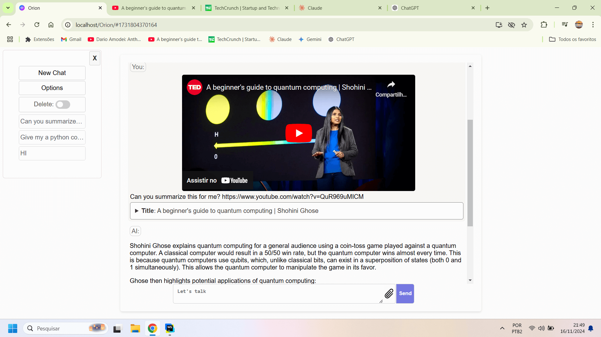
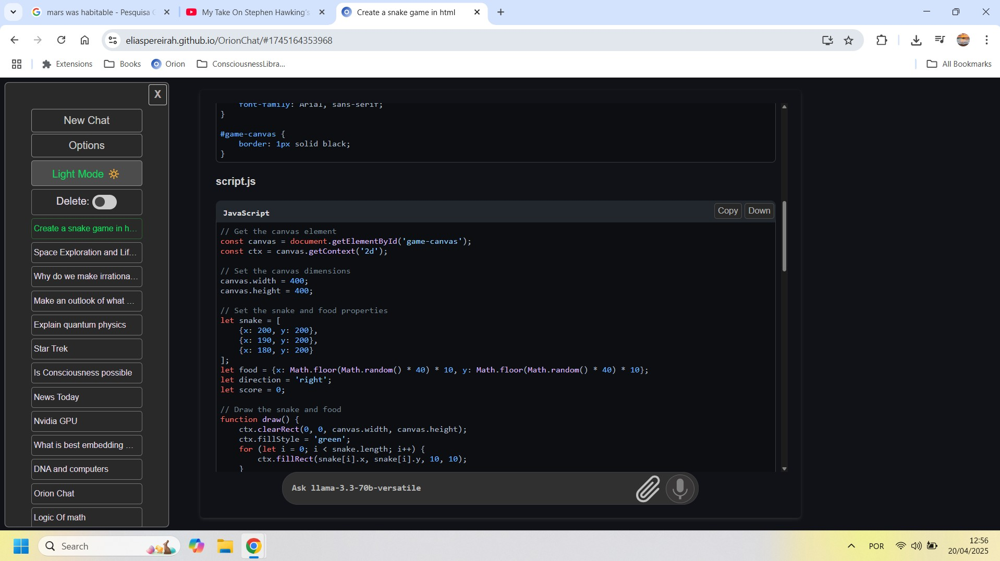

# OrionChat
OrionChat is a web-based chat interface that simplifies interactions with multiple AI model providers.
It provides a unified platform for chatting and exploring multiple large language models (LLMs), including:

- 🌐 OpenAI (GPTs and beyond)
- 🌌 Google (Gemini models)
- 🟡 Anthropic (Claude models)
- 🐳 DeepSeek - Rivaling OpenAI’s frontier models
- 🦄 Ollama – Open-source tool for running LLMs locally (Your own AI galaxy!)
- 🎯 Cohere (Command's models)
- 🚀 Groq Inc. – Optimized for fast inference (open source models) ⚡️
- ⚡️ Cerebras – Also optimized for fast inference 🚀
- 💎 SambaNova - Fast inference
- ♾️ OpenRouter - Gateway to all LLMs
- ☁️ Together AI - The AI Acceleration Cloud
- 📡 Deep Infra - Scalable AI backbone
- 🔥 Hyperbolic - The Open Access AI Cloud


## Screenshot
- **Light theme:**



**Dark Theme:** 




With Orion, you can easily navigate and assess the strengths and limitations of different AI models through an intuitive,
user-friendly interface.

## Key Features

- 🖥️ [Browser](https://eliaspereirah.github.io/OrionChat/) - No need to download anything ⚡️
- ✅ Code Execution (Execute code with Google Gemini)
- 🗣️ TTS - Realistic text-to-speech using ElevenLabs
- 🎙️ STT - Speech-to-Text using Groq/Whisper ️
- 🔄 Seamless integration with multiple AI models
- ✨ Clean and responsive web interface 🌐
- 🌈 Syntax highlighting for code snippets 🖌️
- ⬇️ One-click download for AI-generated code outputs
- 🎛️ Customizable system prompts to tailor responses 🛠️
- 🌐 Special command for quick and easy language translation tasks
- 📁 Upload a variety of documents (text, PDF, images, video) to Google Gemini for analysis and processing
- 🧠 Awesome Prompts 150+ awesome prompts most of them from [Awesome ChatGPT Prompts](https://github.com/f/awesome-chatgpt-prompts) to select with one click.

###### \### Help the project by giving a star. \###


## API Key Management

Your API keys are stored locally using `localStorage`, and requests are sent directly to the official provider's API
(OpenAI, Anthropic, Google, Groq, Cerebras) without routing through any external proxy.


### API Keys
Some companies offer free API access. Check their terms and conditions before you get started.
- **Google Gemini:** [Get your Gemini API key](https://aistudio.google.com/app/apikey) - 🟢 free
- **Cerebras:** [Get your Cerebras API key](https://cloud.cerebras.ai/platform/) - 🟢 free
- **Cohere:** [Get your Cohere API key](https://dashboard.cohere.com/api-keys) - 🟢 free
- **Groq:** [Get your Groq API key](https://console.groq.com/keys) - 🟢 free
- **SambaNova:** [Get your SambaNova API key](https://cloud.sambanova.ai/apis) - 🟢 free
- **Together AI:** 🟢 Free for deepseek-ai/DeepSeek-R1-Distill-Llama-70B-free  [Get your Together AI API key](https://api.together.ai/settings/api-keys)
- **OpenAI:** [OpenAI key](https://platform.openai.com/api-keys)
- **Anthropic:** [Anthropic API key](https://console.anthropic.com/settings/keys)
- **DeepSeek:** [DeepSeek API Key](https://platform.deepseek.com/api_keys)
- **Hyperbolic:** [Hyperbolic API Key](https://app.hyperbolic.xyz/settings#api-key) 
# Special Commands
Use special commands to perform an action quickly and easily.

### Image generation with Google Gemini

- `pic: image of a dog having fun on the beach`
- `imagine: image of a cat playing with a basket`

Both commands above are equivalent, by using "imagine:" or "pic" you will be sending your prompt to the Google Gemini image generation model. 
It will only work when the currently active model is any of Google Gemini.

###  Grounding with Google Search 
- `g: what's the main news today`

The Grounding with Google Search feature in the Gemini API can be used to improve the accuracy and recency of the model's 
responses, essentially an internal RAG within the Gemini API itself.

You can now use this feature when using any Gemini 2.0 model, whether flash or pro, simply by typing `g: + your prompt.`


### Deep Thinking
- ``dt: Explain quantum entanglement``

Claude 3.7 Sonnet is a hybrid model capable of "standard thinking" and "extended thinking".

When you want to use this model's **d**eep **t**hinking, simply type ``dt: + your prompt``.

The same command will work for Gemini models with optional "thinking mode" support like gemini-2.5-flash-preview-04-17


This will give you easy control in switching between the two modes.


### Translation
- ``t:spanish Hello everyone!``

**Translate:** Translate text with ease using special command.
- To translate "Hello everyone!" into Spanish, use: `translate:spanish Hello everyone!` or its short form `t:spanish Hello everyone!`.
- AI will automatically detect the source language, requiring only the target language specification.

## YouTube Summary
Ask AI to summarize a YouTube video or answer any question based on the video caption.
See an example of use below.
- `Summarize this video https://www.youtube.com/watch?v=r7pEdhnS3tI`
- `What is this video about? https://www.youtube.com/watch?v=qQviI1d_hFA`
  It is recommended to use a larger context window model when using this functionality, such as Google Gemini.


### Keyboard shortcut.
- Press `Ctrl + Q` to close the current chat and start a new one.
- Press `Shift + T` on your keyboard to switch between the dark and light theme modes.
### Retrieval-Augmented Generation (RAG)
Search: Perform quick searches and retrieve relevant information with ease from Google.
- Example: `search: What is the latest news?` or `s: What is the latest news?`
### Execution of JavaScript code in the user's browser.
Please perform this functionality with caution and always check code before accepting execution.
- Example: `javascript: How Many R's in 'Strawberry'?` or `js: How Many R's in 'Strawberry'?`
- This will allow the AI to generate Javascript code that will run in your browser.
### Executing Python code in a remote environment
- When using Google Gemini you can ask it to execute codes directly in Google's own remote environment. For now only
  Python codes are executed. The code and output will be returned.
- Command example: `py: Run a python code to write "tseb eht sI noirO" in the inverse order`
- Another example: `py: The United States has a population of 342,524,968, of which 480,000 die annually due to tobacco use. 
What percentage is that?`

# Current Date
An LLM has no way of knowing the current date unless you provide it. To do this, you can add "Today: {{date}}" 
to your system prompt, and this will pass the current date to the LLM every time you send it any message.


# Some Observations
### About images/videos/PDFs 
When you upload an image, video, or PDF to OrionChat, it isn’t stored locally.
You’ll need to re-upload it each time you want the AI to use it as context. 
Otherwise, asking about it may cause the AI to hallucinate. 

The upside is better token efficiency.

### Old chats
Orion will automatically delete older chats when the number of chats exceeds 512, so the maximum chat history will be 512.

The reason for this is to prevent local memory from becoming too full.


# How to Run

If you prefer, you can use OrionChat via GitHub Pages, this is the easiest way and there's no need to download or clone this repository.

Just visit https://eliaspereirah.github.io/OrionChat/

## Run locally

If you want to run OrionChat locally first clone this repository.

You can clone it by running the following command in your terminal:

```bash
git clone https://github.com/EliasPereirah/OrionChat.git
```
Or download the zip file from the repository by clicking on the green button "Code" and then [Download ZIP](https://github.com/EliasPereirah/OrionChat/archive/refs/heads/master.zip).

After downloading, just open the folder and click on index.html if you don't have a server.
If you do, just access the directory where the project was saved, eg: http://localhost/OrionChat/. It's that simple.


# Google CSE API Key
*This will be useful when you are not using Google's Gemini models, as the ``g:`` command will not work.

Sometimes you might want AI to search the web and respond based on that information.


To allow AI to search using Google, you will need Google CSE (Custom Search Engine) API Key and CX.
- First, create a custom search here [Google CSE Panel](https://programmablesearchengine.google.com/controlpanel/all)
- Copy your CX ID
- Go to [Google Developers](https://developers.google.com/custom-search/v1/introduction) and click on *Get a Key* to get your API Key
- Now just enter CX and API key in Orion. for that go to Options -> More Options and make the configuration.
- To use the functionality in chat, you need to put an "s:" at the beginning of your prompt, e.g. "s: what's today's news"
- *Note: Google Search will only return snippets of search results, which may not have enough context for AI to respond.
  It is recommended to implement the solution below for best results.

# Rag Endpoint
For better search results, you can configure a "RAG endpoint".

Just follow the instructions at https://github.com/EliasPereirah/SearchAugmentedLLM/

After that you can enter the search endpoint you just created in the OrionChat interface.
Click on "Options" -> "Advanced" enter the "RAG endpoint" and click "Activate".

Now whenever you want the AI to do a search to answer your question, write at the beginning of your prompt
"s:" + your question, e.g. "s: what's the news today?", The AI will search the web and respond based on the information found.


# Cors
To get around CORS errors when working with SambaNova the API request will pass through `cors-proxy.php`
which will forward the request to the desired platform. This will not hide your IP address, just forward the request.

This is necessary because direct requests via JavaScript in the browser to these platform are not possible.

# YouTube Caption
You can simply share the URL of a YouTube video in the chat to be able to ask something about the video content, 
or ask the AI to make a summary.

To do this, you will need to use this other project: https://github.com/EliasPereirah/YoutubeSubtitlesDownloader/

You can run it on localhost or on a remote server.

After activating the mentioned project, go to "Options" -> "YouTube Captions" and point to the URL where you deployed the project, for example: http://localhost/YoutubeSubtitlesDownloader/

###### \### Help the project by giving a star. \###